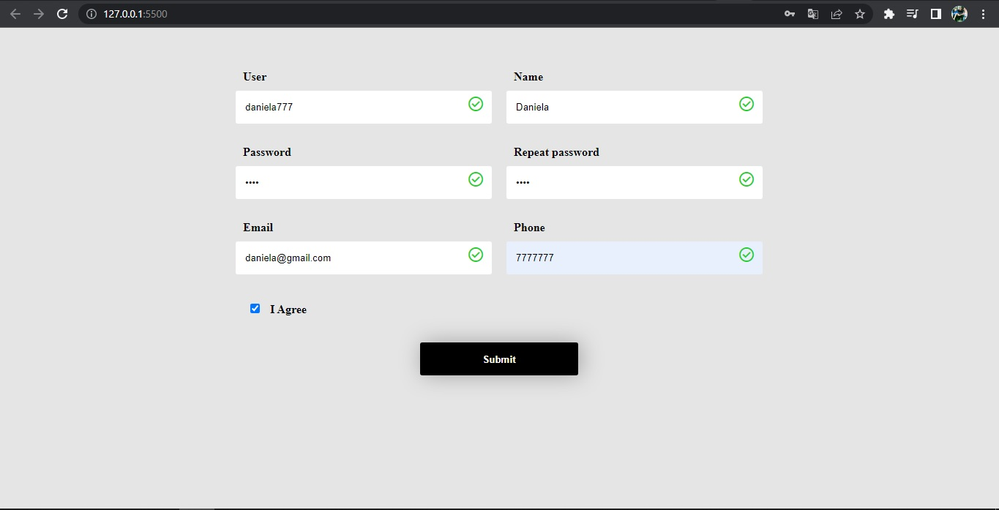

# Basic Form

> Set up the project, the goal here is handle basic validations of a form using JavaScript.

Additional description about the project and its features.

## Built With

- HTML
- CSS
- JavaScript

## Getting Started

### Prerequisites
- GIT 

### Setup
- Clone this [Repository](https://github.com/danyhoshi/form-grid) in order to get a copy of this project
- From develop branch, open the index.html file with your browser.

## Authors

👤 **Author1**

- GitHub: [@danyhoshi](https://github.com/danyhoshi)
- LinkedIn: [@LinkedIn](https://www.linkedin.com/in/daniela-gonz%C3%A1lez-ba16a556/)
- Twitter: [@dany_hoshi](https://twitter.com/Dany_hoshi)

## 🤝 Contributing

Contributions, issues, and feature requests are welcome!

Feel free to check the [issues page](../../issues/).

## Show your support

Give a ⭐️ if you like this project!

## Acknowledgments

- Our Studying group!

## 📝 License

This project is [MIT](./MIT.md) licensed.
